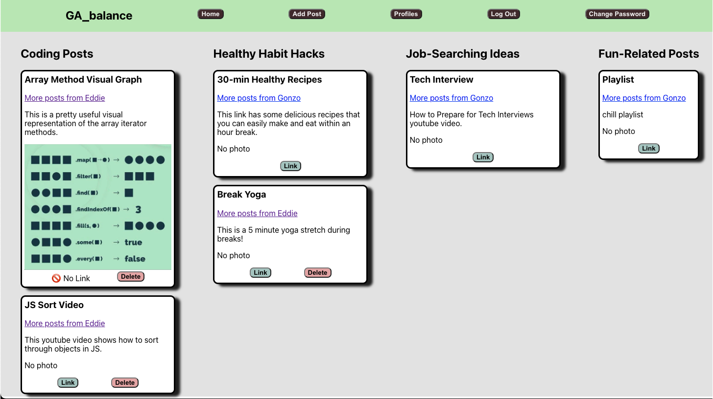

# GA_balance - Front End

  

This is the front end of a decoupled MERN Stack app that includes JWT Authentication. When combined with the back end found [here](https://github.com/eagonzalez1/ga-balance-back-end), this is a social media app focused on sharing the user's dining experience. Unlike most restaurant review apps, Foodie allows reviewers to post specific dishes or cocktails and connect with other like-minded 'foodies.'
  

### [Link to view the deployed webiste](https://foodie-foodfrat.netlify.app/)

[Back End GithHub Repo](https://github.com/eagonzalez1/ga-balance-back-end)
  

__Technologies used:__
 

 

 

 

 

 
Deploying front end with:
 

 
Deploying back end with:
 

 
  

__Credits:__ 
 
  

__Recent changes:__ 
Created App: 27 July 2022 
  

__Icebox Items:__
- Create the ability to 'like' other posts.